<div align = "center">
    <h2> 🦋 ibtissam-laz </h2>
</div>

<br>

<div align = "center">
    <h2>About me</h2>

```sh
  > lifefetch
    🦋 Name: Lily
    🎓 Degree(s): Mathematics & Computer Science
    💻 Work: Full-Stack Web Developer
    📩 Email: smile.lily23@gmail.com
```

</div>

<br>

<div align = "center">
    <h2>🧰 Languages and Tools</h2>
        
        
        
        
        
        
        
        
        
        
        
        
        
        
        
        
        
</div>

<br>

<div align = "center">
    <h2>📊 Stats</h2>
    <div>
        <a>
             
        </a>
        <a>
            
        </a>
        <br>
        <a>
            
        </a>
    </div>
</div>

<br>

<div align = "center">
    <h3>🔗Connect</h3>
    <a href = "mailto:smilelily23@gmail.com">Email</a>
</div>

<!--
**ibtissam-laz/ibtissam-laz** is a ✨ _special_ ✨ repository because its `README.md` (this file) appears on your GitHub profile.

Here are some ideas to get you started:

- 🔭 I’m currently working on ...
- 🌱 I’m currently learning ...
- 👯 I’m looking to collaborate on ...
- 🤔 I’m looking for help with ...
- 💬 Ask me about ...
- 📫 How to reach me: ...
- 😄 Pronouns: ...
- ⚡ Fun fact: ...
-->
